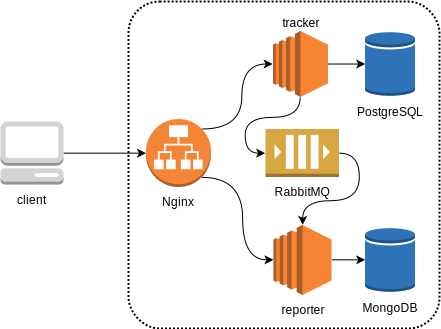

# Expense Tracker

[](https://travis-ci.org/bishoybassem/expense-tracker)
[](https://www.codacy.com/app/bishoybassem/expense-tracker?utm_source=github.com&amp;utm_medium=referral&amp;utm_content=bishoybassem/expense-tracker&amp;utm_campaign=Badge_Grade)
[](https://www.codacy.com/app/bishoybassem/expense-tracker?utm_source=github.com&amp;utm_medium=referral&amp;utm_content=bishoybassem/expense-tracker&amp;utm_campaign=Badge_Coverage)

This project implements a web application for tracking expenses, where users would log their daily expenses/incomes, and get back daily/monthly/yearly expense reports. The aim of this project is to practice microservices architecture, not only the application development aspect, but the whole continuous integration (CI) pipeline. 

## Features
* An automatic build triggered by [Travis CI](https://travis-ci.org/bishoybassem/expense-tracker) that does the following:
  * Compiles the code.
  * Runs unit tests.
  * Starts all apps and services in containers.
  * Runs integration/blackbox tests.
  * Collects code coverage during unit and integration test executions.
  * Uploads code coverage to [Codacy](https://app.codacy.com/project/bishoybassem/expense-tracker/dashboard).
* An automatic code scan (static analysis) triggered by [Codacy](https://app.codacy.com/project/bishoybassem/expense-tracker/dashboard).

## Implementation

The application's architecture is shown in the bellow diagram, in addition to brief descriptions for the webapps and Gradle modules within this project:



* __tracker__: a microservice implemented with Spring Boot that has the following responsibilities:
  * Offers CRUD API for managing the transactions (expenses/incomes).
  * Persists the transaction data to a PostgreSQL database.
  * Notifies other services about transaction events asynchronously through RabbitMQ.

* __reporter__: a microservice implemented with Spring Boot that has the following responsibilities:
  * Consumes transaction events from RabbitMQ (posted by the tracker microservice).
  * Aggregates the transaction data to the corresponding reports, and persists it to a MongoDB instance.
  * Offers an API for querying the reports.

* __mq-messages__: a module that offers POJOs, used for the exchange of transaction events between the producers (tracker) and the consumers (reporter).
[Protobuf](https://developers.google.com/protocol-buffers) is used for generating the POJOs, as well as serialization/deserialization of the event messages.

* __blackbox-tests__: a module that includes full integration tests, simulating different workflows.

## Requirements
To test the setup locally, the following needs to be present/installed:
* JDK (used OpenJDK version 11.0.4).
* Docker (used version 18.09.0-ce).
* Docker Compose (used version 1.23.2).

## Steps
1. Clone the repository, and navigate to the clone directory.
2. Compile the code, assemble the webapps, and start all the services in Docker by executing this task:
   ```bash
   ./gradlew composeUp
   ```
3. Create a transaction (tracker listens on port 8080)
   ```bash
   curl -X POST http://localhost:8080/v1/transactions -H 'Content-Type: application/json' \
     -d '{"type": "EXPENSE","amount": "1.23","category": "abc","date": "2017/03/20","comment": "comment"}'
   ```

4. Query the report (reporter listens on port 8081)
   ```bash
   curl http://localhost:8080/v1/reports/2017/03/20
   ```